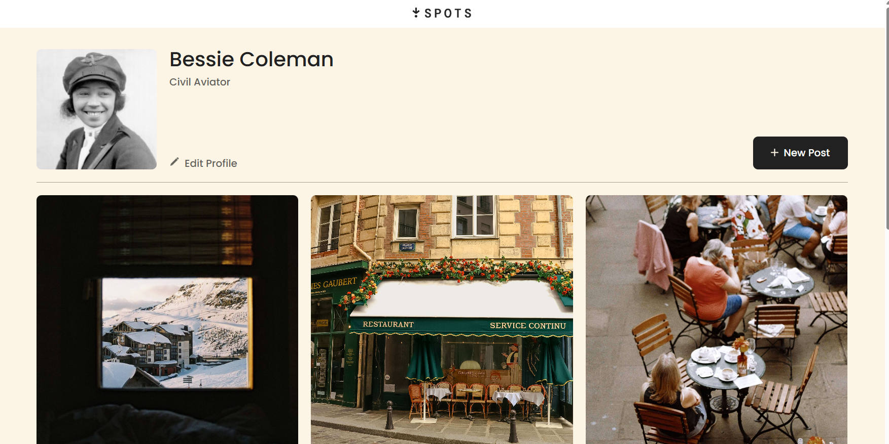

# Project 3: Spots

### Overview

- Intro
- Figma
- Techniques
- Images
- Web link

**Intro**

This project is made so all the elements are displayed correctly on popular screen sizes through the use of adaptive web design. A design template from figma was used as a reference. This project is an interactive application that allows users to add a collection of photos to their profile.

**Figma**

- [Link to the project on Figma](https://www.figma.com/file/BBNm2bC3lj8QQMHlnqRsga/Sprint-3-Project-%E2%80%94-Spots?type=design&node-id=2%3A60&mode=design&t=afgNFybdorZO6cQo-1)

**Project features**

- Flexbox
- Adaptive web design
- Grid Layout
- Semantic HTML

**Images**

**Web Link**
